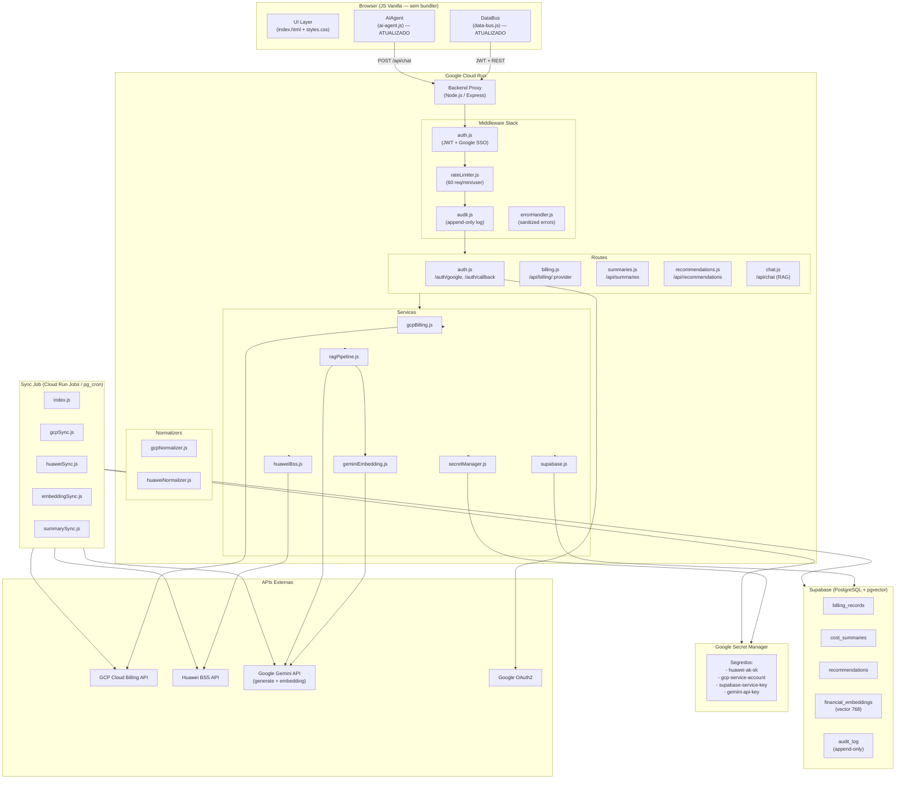
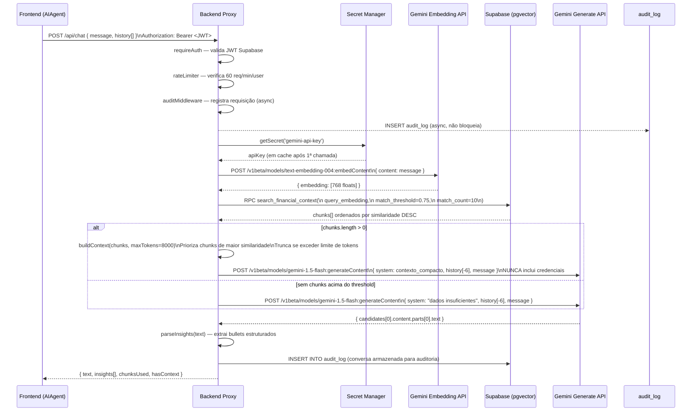
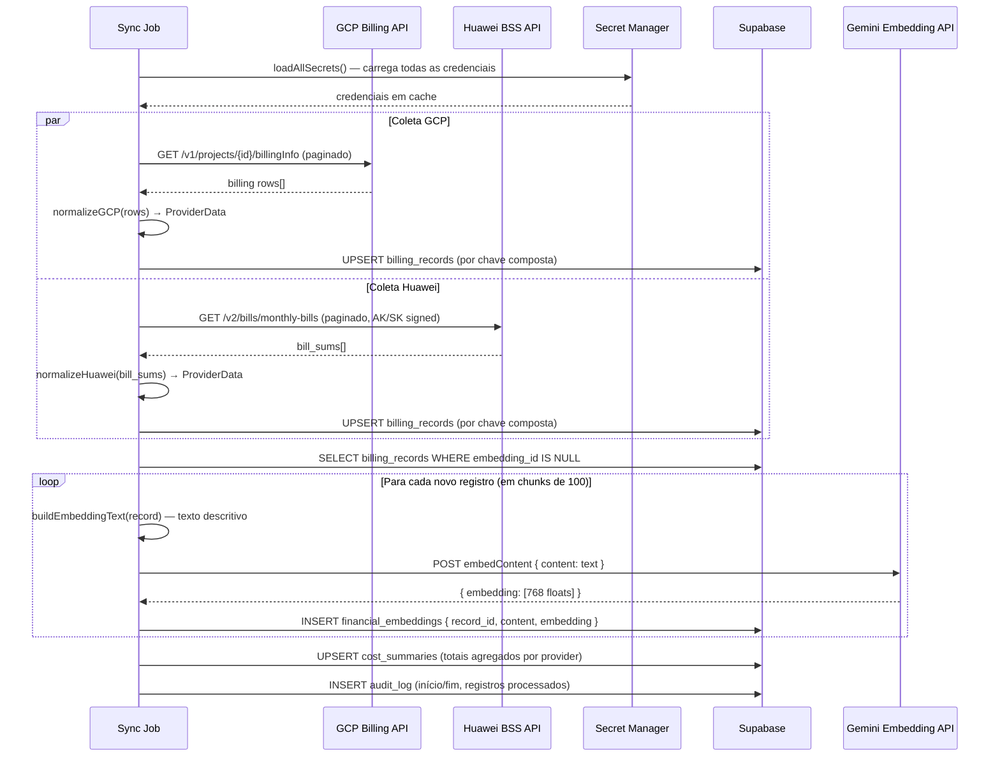

# Design Document: finops-backend-supabase

## Visão Geral

O **finops-backend-supabase** introduz uma camada de backend Node.js para o FinOps Dashboard V2 da EXA, eliminando os problemas estruturais da arquitetura client-side atual: credenciais expostas no browser, bloqueios de CORS, ausência de persistência e limitações de context window no chat com IA.

A solução é composta por quatro componentes principais:

1. **Backend Proxy** — serviço Node.js/Express hospedado no Cloud Run que intermedia todas as chamadas às APIs de cloud (GCP Billing, Huawei BSS), valida autenticação via Google SSO restrita ao domínio corporativo da EXA, aplica rate limiting e registra auditoria.
2. **Sync Job** — processo Node.js agendado que coleta dados das APIs de cloud, normaliza para o formato `ProviderData`, persiste no Supabase e gera embeddings vetoriais para o pipeline RAG.
3. **Schema Supabase** — banco PostgreSQL gerenciado com cinco tabelas (`billing_records`, `cost_summaries`, `recommendations`, `financial_embeddings`, `audit_log`), Row Level Security, extensão `pgvector` e `pg_cron`.
4. **Pipeline RAG** — endpoint de chat que usa busca vetorial semântica para construir contexto compacto antes de chamar a Gemini API, substituindo o envio de dados brutos do browser.

O frontend permanece em JS vanilla sem bundler. O `DataBus` e o `AIAgent` são atualizados para consumir o backend proxy em vez de chamar APIs de cloud diretamente.

---

## Arquitetura

### Diagrama Geral



### Estrutura de Arquivos do Projeto

```
backend/
├── src/
│   ├── server.js                  # Entry point Express — registra middleware e rotas
│   ├── config/
│   │   ├── env.js                 # Variáveis de ambiente não sensíveis
│   │   └── secrets.js             # Loader do Secret Manager (lazy, com cache)
│   ├── middleware/
│   │   ├── auth.js                # Validação JWT Supabase + Google SSO
│   │   ├── rateLimiter.js         # Rate limiting: 60 req/min/usuário
│   │   ├── audit.js               # Middleware de auditoria (append-only)
│   │   └── errorHandler.js        # Handler global — sanitiza erros antes de responder
│   ├── routes/
│   │   ├── auth.js                # GET /auth/google, GET /auth/callback, POST /auth/logout
│   │   ├── billing.js             # GET /api/billing/:provider?period=30
│   │   ├── summaries.js           # GET /api/summaries?period=30
│   │   ├── recommendations.js     # GET /api/recommendations
│   │   └── chat.js                # POST /api/chat  { message, history[] }
│   ├── services/
│   │   ├── gcpBilling.js          # Cliente GCP Cloud Billing API
│   │   ├── huaweiBss.js           # Cliente Huawei BSS API (AK/SK via Secret Manager)
│   │   ├── supabase.js            # Cliente Supabase + queries tipadas
│   │   ├── secretManager.js       # Google Secret Manager — acesso e cache de segredos
│   │   ├── geminiEmbedding.js     # Gemini Embedding API (text-embedding-004, dim 768)
│   │   └── ragPipeline.js         # RAG: embed → busca vetorial → contexto → Gemini
│   └── normalizers/
│       ├── gcpNormalizer.js       # Resposta GCP → ProviderData
│       └── huaweiNormalizer.js    # Resposta Huawei → ProviderData
├── sync/
│   ├── index.js                   # Entry point do Sync Job
│   ├── gcpSync.js                 # Coleta e upsert de billing GCP
│   ├── huaweiSync.js              # Coleta e upsert de billing Huawei
│   ├── embeddingSync.js           # Geração e armazenamento de embeddings
│   └── summarySync.js             # Agregação de cost_summaries
├── migrations/
│   └── 001_initial_schema.sql     # Schema completo do Supabase
├── Dockerfile
├── .env.example
└── package.json
```

### Endpoints da API

| Método | Endpoint | Auth | Descrição |
|--------|----------|------|-----------|
| `GET` | `/health` | Não | `{ status: 'ok', version, uptime }` |
| `GET` | `/auth/google` | Não | Redireciona para OAuth2 do Google |
| `GET` | `/auth/callback` | Não | Callback OAuth2 — cria sessão Supabase, redireciona com JWT |
| `POST` | `/auth/logout` | JWT | Invalida sessão |
| `GET` | `/api/billing/:provider` | JWT | `provider`: `gcp` \| `huawei` \| `all`; `?period=30` |
| `GET` | `/api/summaries` | JWT | Retorna `UnifiedSummary` da tabela `cost_summaries`; `?period=30` |
| `GET` | `/api/recommendations` | JWT | Lista de recomendações |
| `POST` | `/api/chat` | JWT | `{ message, history[] }` → `{ text, insights[] }` |

---

## Componentes e Interfaces

### 1. server.js — Entry Point Express

```javascript
// src/server.js
const express = require('express');
const cors = require('cors');
const helmet = require('helmet');
const { rateLimiter } = require('./middleware/rateLimiter');
const { auditMiddleware } = require('./middleware/audit');
const { errorHandler } = require('./middleware/errorHandler');
const { ENV } = require('./config/env');

const app = express();

// Segurança
app.use(helmet());
app.use(cors({
  origin: ENV.FRONTEND_URL,
  credentials: true,
  methods: ['GET', 'POST', 'OPTIONS'],
  allowedHeaders: ['Authorization', 'Content-Type']
}));
app.use(express.json({ limit: '1mb' }));

// Força HTTPS em produção
app.use((req, res, next) => {
  if (ENV.NODE_ENV === 'production' && req.headers['x-forwarded-proto'] !== 'https') {
    return res.redirect(301, `https://${req.headers.host}${req.url}`);
  }
  next();
});

// Health check (sem auth)
app.get('/health', (req, res) => {
  res.json({ status: 'ok', version: process.env.npm_package_version, uptime: process.uptime() });
});

// Rotas de autenticação (sem rate limit global)
app.use('/auth', require('./routes/auth'));

// Middleware de autenticação + rate limit + auditoria para rotas de dados
app.use('/api', require('./middleware/auth').requireAuth);
app.use('/api', rateLimiter);
app.use('/api', auditMiddleware);

// Rotas de dados
app.use('/api/billing', require('./routes/billing'));
app.use('/api/summaries', require('./routes/summaries'));
app.use('/api/recommendations', require('./routes/recommendations'));
app.use('/api/chat', require('./routes/chat'));

// Handler global de erros (deve ser o último)
app.use(errorHandler);

// Graceful shutdown
const server = app.listen(ENV.PORT, () => {
  console.log(`[Server] Listening on port ${ENV.PORT}`);
});

process.on('SIGTERM', () => {
  console.log('[Server] SIGTERM received — graceful shutdown');
  server.close(() => {
    console.log('[Server] Closed');
    process.exit(0);
  });
  // Força encerramento após 30s
  setTimeout(() => process.exit(1), 30000);
});

module.exports = app;
```

### 2. config/env.js — Configurações Não Sensíveis

```javascript
// src/config/env.js
const ENV = {
  NODE_ENV:           process.env.NODE_ENV || 'development',
  PORT:               parseInt(process.env.PORT || '8080'),
  FRONTEND_URL:       process.env.FRONTEND_URL || 'http://localhost:3000',
  CORPORATE_DOMAIN:   process.env.CORPORATE_DOMAIN,          // ex: 'exa.com.br'
  SUPABASE_URL:       process.env.SUPABASE_URL,
  SUPABASE_ANON_KEY:  process.env.SUPABASE_ANON_KEY,         // chave pública (não sensível)
  GCP_PROJECT_ID:     process.env.GCP_PROJECT_ID,
  GOOGLE_CLIENT_ID:   process.env.GOOGLE_CLIENT_ID,
  GOOGLE_REDIRECT_URI: process.env.GOOGLE_REDIRECT_URI,
  RAG_SIMILARITY_THRESHOLD: parseFloat(process.env.RAG_SIMILARITY_THRESHOLD || '0.75'),
  RAG_MAX_CHUNKS:     parseInt(process.env.RAG_MAX_CHUNKS || '10'),
  RAG_MAX_TOKENS:     parseInt(process.env.RAG_MAX_TOKENS || '8000'),
  RATE_LIMIT_WINDOW_MS: parseInt(process.env.RATE_LIMIT_WINDOW_MS || '60000'),
  RATE_LIMIT_MAX:     parseInt(process.env.RATE_LIMIT_MAX || '60'),
};

// Valida variáveis obrigatórias na inicialização
const REQUIRED = ['CORPORATE_DOMAIN', 'SUPABASE_URL', 'SUPABASE_ANON_KEY', 'GCP_PROJECT_ID', 'GOOGLE_CLIENT_ID'];
for (const key of REQUIRED) {
  if (!ENV[key]) throw new Error(`[Config] Variável de ambiente obrigatória ausente: ${key}`);
}

module.exports = { ENV };
```

### 3. config/secrets.js — Google Secret Manager

```javascript
// src/config/secrets.js
const { SecretManagerServiceClient } = require('@google-cloud/secret-manager');
const { ENV } = require('./env');

const client = new SecretManagerServiceClient();
const _cache = new Map();

/**
 * Busca um segredo do Secret Manager com cache em memória.
 * NUNCA registra o valor em logs.
 * @param {string} secretName - Nome do segredo (sem projeto/versão)
 * @returns {Promise<string>} Valor do segredo
 */
async function getSecret(secretName) {
  if (_cache.has(secretName)) return _cache.get(secretName);

  const name = `projects/${ENV.GCP_PROJECT_ID}/secrets/${secretName}/versions/latest`;
  const [version] = await client.accessSecretVersion({ name });
  const value = version.payload.data.toString('utf8');

  _cache.set(secretName, value);
  return value;
}

/**
 * Carrega todos os segredos necessários na inicialização.
 * Falha explicitamente se qualquer segredo estiver ausente.
 */
async function loadAllSecrets() {
  const secrets = [
    'huawei-ak',
    'huawei-sk',
    'gcp-service-account-json',
    'supabase-service-role-key',
    'gemini-api-key',
    'google-client-secret',
  ];

  for (const name of secrets) {
    await getSecret(name); // lança exceção se indisponível
  }
  console.log('[Secrets] Todos os segredos carregados com sucesso');
}

module.exports = { getSecret, loadAllSecrets };
```

### 4. middleware/auth.js — Validação JWT + Google SSO

```javascript
// src/middleware/auth.js
const { createClient } = require('@supabase/supabase-js');
const { ENV } = require('../config/env');

const supabase = createClient(ENV.SUPABASE_URL, ENV.SUPABASE_ANON_KEY);

/**
 * Middleware que valida o JWT do Supabase em cada requisição.
 * Stateless: não armazena sessão no servidor.
 */
async function requireAuth(req, res, next) {
  const authHeader = req.headers.authorization;
  if (!authHeader || !authHeader.startsWith('Bearer ')) {
    return res.status(401).json({ error: 'Token de autenticação ausente' });
  }

  const token = authHeader.slice(7);
  const { data: { user }, error } = await supabase.auth.getUser(token);

  if (error || !user) {
    return res.status(401).json({ error: 'Token inválido ou expirado' });
  }

  // Verifica domínio corporativo
  const domain = user.email?.split('@')[1];
  if (domain !== ENV.CORPORATE_DOMAIN) {
    return res.status(403).json({ error: 'Acesso restrito ao domínio corporativo' });
  }

  req.user = user;
  req.token = token;
  next();
}

module.exports = { requireAuth };
```

### 5. middleware/rateLimiter.js

```javascript
// src/middleware/rateLimiter.js
const rateLimit = require('express-rate-limit');

const rateLimiter = rateLimit({
  windowMs: parseInt(process.env.RATE_LIMIT_WINDOW_MS || '60000'), // 1 minuto
  max: parseInt(process.env.RATE_LIMIT_MAX || '60'),               // 60 req/min
  keyGenerator: (req) => req.user?.email || req.ip,                // por usuário autenticado
  standardHeaders: true,
  legacyHeaders: false,
  message: { error: 'Limite de requisições excedido. Tente novamente em 1 minuto.' },
  skip: (req) => req.path === '/health',
});

module.exports = { rateLimiter };
```

### 6. middleware/audit.js — Auditoria Append-Only

```javascript
// src/middleware/audit.js
const { getSupabaseServiceClient } = require('../services/supabase');

/**
 * Middleware que registra cada requisição autenticada no audit_log.
 * Nunca registra valores de credenciais ou tokens.
 */
async function auditMiddleware(req, res, next) {
  // Sanitiza parâmetros — remove campos sensíveis
  const safeParams = sanitizeParams({ ...req.query, ...req.body });

  const entry = {
    user_email: req.user?.email,
    action: `${req.method} ${req.path}`,
    payload: safeParams,
    ip_address: req.ip || req.headers['x-forwarded-for'],
    created_at: new Date().toISOString(),
  };

  // Insere de forma assíncrona — não bloqueia a resposta
  const supabase = getSupabaseServiceClient();
  supabase.from('audit_log').insert(entry).then(({ error }) => {
    if (error) console.error('[Audit] Falha ao registrar:', error.message);
  });

  next();
}

/**
 * Remove campos sensíveis dos parâmetros antes de registrar.
 */
function sanitizeParams(params) {
  const SENSITIVE = ['password', 'token', 'secret', 'key', 'authorization', 'ak', 'sk'];
  const result = {};
  for (const [k, v] of Object.entries(params || {})) {
    if (SENSITIVE.some(s => k.toLowerCase().includes(s))) {
      result[k] = '[REDACTED]';
    } else {
      result[k] = v;
    }
  }
  return result;
}

module.exports = { auditMiddleware, sanitizeParams };
```

### 7. middleware/errorHandler.js — Erros Sanitizados

```javascript
// src/middleware/errorHandler.js

/**
 * Handler global de erros.
 * Sanitiza respostas — nunca expõe stack traces ou detalhes de infraestrutura.
 */
function errorHandler(err, req, res, next) {
  // Log interno completo (nunca enviado ao cliente)
  console.error('[ErrorHandler]', {
    message: err.message,
    stack: err.stack,
    path: req.path,
    user: req.user?.email,
  });

  const status = err.status || err.statusCode || 500;

  // Mapeamento de erros conhecidos para mensagens seguras
  const SAFE_MESSAGES = {
    401: 'Não autenticado',
    403: 'Acesso negado',
    404: 'Recurso não encontrado',
    429: 'Limite de requisições excedido',
    503: 'Serviço temporariamente indisponível',
  };

  res.status(status).json({
    error: SAFE_MESSAGES[status] || 'Erro interno do servidor',
    ...(process.env.NODE_ENV === 'development' && { detail: err.message }),
  });
}

module.exports = { errorHandler };
```

### 8. services/secretManager.js — Interface de Segredos

```typescript
// Interface TypeScript para documentação
interface SecretsService {
  getSecret(name: string): Promise<string>
  loadAllSecrets(): Promise<void>
}

// Segredos disponíveis:
// 'huawei-ak'                  — Access Key da Huawei Cloud
// 'huawei-sk'                  — Secret Key da Huawei Cloud
// 'gcp-service-account-json'   — JSON do service account GCP
// 'supabase-service-role-key'  — Chave de serviço do Supabase (bypass RLS)
// 'gemini-api-key'             — Chave da Gemini API
// 'google-client-secret'       — Client Secret do OAuth2 Google
```

### 9. services/supabase.js — Cliente Supabase

```javascript
// src/services/supabase.js
const { createClient } = require('@supabase/supabase-js');
const { ENV } = require('../config/env');
const { getSecret } = require('../config/secrets');

let _serviceClient = null;

/**
 * Retorna cliente Supabase com service role key (bypass RLS).
 * Usado apenas pelo backend — nunca exposto ao frontend.
 */
async function getSupabaseServiceClient() {
  if (_serviceClient) return _serviceClient;
  const serviceKey = await getSecret('supabase-service-role-key');
  _serviceClient = createClient(ENV.SUPABASE_URL, serviceKey);
  return _serviceClient;
}

/**
 * Busca resumos de custo por período.
 * @param {number} periodDays
 * @returns {Promise<UnifiedSummary>}
 */
async function getCostSummaries(periodDays) {
  const supabase = await getSupabaseServiceClient();
  const since = new Date(Date.now() - periodDays * 86400000).toISOString();

  const { data, error } = await supabase
    .from('cost_summaries')
    .select('*')
    .gte('period_start', since)
    .order('period_start', { ascending: false });

  if (error) throw new Error(`[Supabase] getCostSummaries: ${error.message}`);
  return data;
}

/**
 * Busca registros de billing por provider e período.
 */
async function getBillingRecords(provider, periodDays) {
  const supabase = await getSupabaseServiceClient();
  const since = new Date(Date.now() - periodDays * 86400000).toISOString();

  let query = supabase
    .from('billing_records')
    .select('*')
    .gte('period_start', since)
    .order('cost', { ascending: false });

  if (provider !== 'all') query = query.eq('provider', provider);

  const { data, error } = await query;
  if (error) throw new Error(`[Supabase] getBillingRecords: ${error.message}`);
  return data;
}

/**
 * Busca chunks por similaridade vetorial.
 * @param {number[]} embedding - Vetor de 768 dimensões
 * @param {number} limit - Número máximo de chunks
 * @param {number} threshold - Similaridade mínima (0-1)
 */
async function searchFinancialContext(embedding, limit = 10, threshold = 0.75) {
  const supabase = await getSupabaseServiceClient();
  const { data, error } = await supabase.rpc('search_financial_context', {
    query_embedding: embedding,
    match_threshold: threshold,
    match_count: limit,
  });
  if (error) throw new Error(`[Supabase] searchFinancialContext: ${error.message}`);
  return data || [];
}

module.exports = { getSupabaseServiceClient, getCostSummaries, getBillingRecords, searchFinancialContext };
```

### 10. services/ragPipeline.js — Pipeline RAG

```javascript
// src/services/ragPipeline.js
const { generateEmbedding } = require('./geminiEmbedding');
const { searchFinancialContext } = require('./supabase');
const { getSecret } = require('../config/secrets');
const { ENV } = require('../config/env');

/**
 * Executa o pipeline RAG completo:
 * 1. Gera embedding da mensagem do usuário
 * 2. Busca chunks relevantes no Supabase
 * 3. Monta contexto compacto
 * 4. Chama Gemini com contexto + pergunta
 * 5. Retorna resposta estruturada
 *
 * NUNCA inclui credenciais no payload enviado ao Gemini.
 */
async function runRAGPipeline(message, history = []) {
  // 1. Embed da mensagem
  const queryEmbedding = await generateEmbedding(message);

  // 2. Busca vetorial
  const chunks = await searchFinancialContext(
    queryEmbedding,
    ENV.RAG_MAX_CHUNKS,
    ENV.RAG_SIMILARITY_THRESHOLD
  );

  // 3. Monta contexto
  const hasContext = chunks.length > 0;
  const context = hasContext
    ? buildContext(chunks, ENV.RAG_MAX_TOKENS)
    : null;

  // 4. Chama Gemini
  const geminiApiKey = await getSecret('gemini-api-key');
  const response = await callGemini(message, context, history, geminiApiKey);

  return {
    text: response.text,
    insights: response.insights,
    chunksUsed: chunks.length,
    hasContext,
  };
}

/**
 * Monta contexto compacto a partir dos chunks, respeitando o limite de tokens.
 * Prioriza chunks de maior similaridade (já ordenados pelo Supabase).
 */
function buildContext(chunks, maxTokens) {
  const APPROX_CHARS_PER_TOKEN = 4;
  const maxChars = maxTokens * APPROX_CHARS_PER_TOKEN;

  let context = 'DADOS FINANCEIROS RELEVANTES:\n\n';
  let totalChars = context.length;

  for (const chunk of chunks) {
    const chunkText = `[${chunk.record_type}] ${chunk.content}\n`;
    if (totalChars + chunkText.length > maxChars) break;
    context += chunkText;
    totalChars += chunkText.length;
  }

  return context;
}

/**
 * Chama a Gemini API com contexto RAG.
 * IMPORTANTE: nunca inclui credenciais no payload.
 */
async function callGemini(message, context, history, apiKey) {
  const systemPrompt = context
    ? `Você é um especialista em FinOps. Responda em português brasileiro baseando-se nos dados abaixo.\n\n${context}`
    : `Você é um especialista em FinOps. Responda em português brasileiro. IMPORTANTE: não há dados financeiros suficientes para responder com precisão — informe isso ao usuário.`;

  const contents = [
    { role: 'user', parts: [{ text: systemPrompt }] },
    { role: 'model', parts: [{ text: 'Entendido. Pronto para analisar os dados financeiros.' }] },
    ...history.slice(-6).map(m => ({
      role: m.role === 'user' ? 'user' : 'model',
      parts: [{ text: m.content }],
    })),
    { role: 'user', parts: [{ text: message }] },
  ];

  const res = await fetch(
    `https://generativelanguage.googleapis.com/v1beta/models/gemini-1.5-flash:generateContent?key=${apiKey}`,
    {
      method: 'POST',
      headers: { 'Content-Type': 'application/json' },
      body: JSON.stringify({
        contents,
        generationConfig: { temperature: 0.3, maxOutputTokens: 1024 },
      }),
    }
  );

  if (!res.ok) throw new Error(`Gemini API error: ${res.status}`);
  const data = await res.json();
  const text = data.candidates?.[0]?.content?.parts?.[0]?.text || '';
  return { text, insights: parseInsights(text) };
}

function parseInsights(text) {
  return text.split('\n')
    .filter(l => l.trim() && (l.includes('•') || l.match(/^[🔴🟠🟡🟢💰⚠️]/u)))
    .slice(0, 5)
    .map((line, i) => ({ id: i + 1, text: line.trim(), severity: i === 0 ? 'high' : 'medium' }));
}

module.exports = { runRAGPipeline, buildContext };
```

### 11. normalizers/gcpNormalizer.js

```javascript
// src/normalizers/gcpNormalizer.js

/**
 * Converte resposta da GCP Cloud Billing API para o formato ProviderData.
 * @param {Object} gcpResponse - Resposta bruta da API
 * @param {string} periodStart
 * @param {string} periodEnd
 * @returns {ProviderData}
 */
function normalizeGCP(gcpResponse, periodStart, periodEnd) {
  const projects = {};

  for (const row of (gcpResponse.rows || [])) {
    const projectId = row.dimensions?.find(d => d.key === 'project.id')?.value || 'unknown';
    const projectName = row.dimensions?.find(d => d.key === 'project.name')?.value || projectId;
    const service = row.dimensions?.find(d => d.key === 'service.description')?.value || 'Other';
    const region = row.dimensions?.find(d => d.key === 'location.region')?.value || 'global';
    const cost = parseFloat(row.metrics?.[0]?.values?.[0]?.moneyValue?.units || '0');

    if (!projects[projectId]) {
      projects[projectId] = { id: projectId, name: projectName, provider: 'gcp', currentCost: 0, services: [], region };
    }
    projects[projectId].currentCost += cost;
    projects[projectId].services.push({ name: service, cost });
  }

  const projectList = Object.values(projects);
  const totalCost = projectList.reduce((s, p) => s + p.currentCost, 0);

  return {
    provider: 'gcp',
    period_start: periodStart,
    period_end: periodEnd,
    summary: { currentCost: totalCost, previousCost: 0, budget: 0, totalWaste: 0, potentialSaving: 0 },
    projects: projectList,
    services: aggregateServices(projectList),
    regions: aggregateRegions(projectList),
    timeline: [],
    waste: [],
    recommendations: [],
  };
}

function aggregateServices(projects) {
  const map = {};
  for (const p of projects) {
    for (const s of (p.services || [])) {
      map[s.name] = (map[s.name] || 0) + s.cost;
    }
  }
  return Object.entries(map).map(([name, cost]) => ({ name, cost })).sort((a, b) => b.cost - a.cost);
}

function aggregateRegions(projects) {
  const map = {};
  for (const p of projects) {
    map[p.region] = (map[p.region] || 0) + p.currentCost;
  }
  return Object.entries(map).map(([region, cost]) => ({ region, cost }));
}

module.exports = { normalizeGCP };
```

### 12. normalizers/huaweiNormalizer.js

```javascript
// src/normalizers/huaweiNormalizer.js

/**
 * Converte resposta da Huawei BSS API para o formato ProviderData.
 * @param {Object} huaweiResponse - Resposta bruta da BSS API
 * @param {string} periodStart
 * @param {string} periodEnd
 * @returns {ProviderData}
 */
function normalizeHuawei(huaweiResponse, periodStart, periodEnd) {
  const billSums = huaweiResponse.bill_sums || [];
  const projects = {};

  for (const bill of billSums) {
    const projectId = bill.enterprise_project_id || 'default';
    const projectName = bill.enterprise_project_name || 'Default Project';
    const service = bill.cloud_service_type_name || bill.cloud_service_type || 'Other';
    const cost = parseFloat(bill.consume_amount || '0');
    const region = bill.region || 'cn-north-4';

    if (!projects[projectId]) {
      projects[projectId] = { id: projectId, name: projectName, provider: 'huawei', currentCost: 0, services: [], region };
    }
    projects[projectId].currentCost += cost;
    projects[projectId].services.push({ name: service, cost });
  }

  const projectList = Object.values(projects);
  const totalCost = projectList.reduce((s, p) => s + p.currentCost, 0);

  return {
    provider: 'huawei',
    period_start: periodStart,
    period_end: periodEnd,
    summary: { currentCost: totalCost, previousCost: 0, budget: 0, totalWaste: 0, potentialSaving: 0 },
    projects: projectList,
    services: aggregateServices(projectList),
    regions: aggregateRegions(projectList),
    timeline: [],
    waste: [],
    recommendations: [],
  };
}

function aggregateServices(projects) {
  const map = {};
  for (const p of projects) {
    for (const s of (p.services || [])) {
      map[s.name] = (map[s.name] || 0) + s.cost;
    }
  }
  return Object.entries(map).map(([name, cost]) => ({ name, cost })).sort((a, b) => b.cost - a.cost);
}

function aggregateRegions(projects) {
  const map = {};
  for (const p of projects) {
    map[p.region] = (map[p.region] || 0) + p.currentCost;
  }
  return Object.entries(map).map(([region, cost]) => ({ region, cost }));
}

module.exports = { normalizeHuawei };
```

---

## Modelos de Dados

### ProviderData (formato normalizado — compatível com DataBus existente)

```typescript
interface ProviderData {
  provider: 'gcp' | 'huawei'
  period_start: string          // ISO 8601
  period_end: string
  summary: {
    currentCost: number
    previousCost: number
    budget: number
    totalWaste: number
    potentialSaving: number
  }
  projects: NormalizedProject[]
  services: { name: string; cost: number }[]
  regions: { region: string; cost: number }[]
  timeline: { date: string; cost: number }[]
  waste: WasteCategory[]
  recommendations: Recommendation[]
}

interface NormalizedProject {
  id: string
  name: string
  provider: 'gcp' | 'huawei'
  currentCost: number
  previousCost?: number
  budget?: number
  services: { name: string; cost: number }[]
  region?: string
  tags?: Record<string, string>
}
```

### Schema Supabase — SQL Completo

```sql
-- migrations/001_initial_schema.sql

-- ─── Extensões ────────────────────────────────────────────────────────────────
CREATE EXTENSION IF NOT EXISTS "pgvector";
CREATE EXTENSION IF NOT EXISTS "pg_cron";
CREATE EXTENSION IF NOT EXISTS "uuid-ossp";

-- ─── Enum: fonte de recomendação ──────────────────────────────────────────────
CREATE TYPE recommendation_source AS ENUM ('gcp_recommender', 'huawei', 'gemini_ai');
CREATE TYPE recommendation_status  AS ENUM ('open', 'in_progress', 'done', 'dismissed');

-- ─── Tabela: billing_records ──────────────────────────────────────────────────
CREATE TABLE billing_records (
  id            UUID PRIMARY KEY DEFAULT uuid_generate_v4(),
  provider      TEXT NOT NULL CHECK (provider IN ('gcp', 'huawei')),
  project_id    TEXT NOT NULL,
  project_name  TEXT NOT NULL,
  service       TEXT,
  cost          NUMERIC(14, 4) NOT NULL DEFAULT 0,
  currency      TEXT NOT NULL DEFAULT 'BRL',
  period_start  TIMESTAMPTZ NOT NULL,
  period_end    TIMESTAMPTZ NOT NULL,
  region        TEXT,
  tags          JSONB DEFAULT '{}',
  raw_payload   JSONB,
  synced_at     TIMESTAMPTZ NOT NULL DEFAULT NOW(),
  UNIQUE (provider, project_id, service, period_start, period_end)
);

CREATE INDEX idx_billing_provider_period ON billing_records (provider, period_start DESC);
CREATE INDEX idx_billing_project         ON billing_records (project_id);

-- ─── Tabela: cost_summaries ───────────────────────────────────────────────────
CREATE TABLE cost_summaries (
  id               UUID PRIMARY KEY DEFAULT uuid_generate_v4(),
  provider         TEXT NOT NULL,
  period_start     TIMESTAMPTZ NOT NULL,
  period_end       TIMESTAMPTZ NOT NULL,
  total_cost       NUMERIC(14, 4) NOT NULL DEFAULT 0,
  total_waste      NUMERIC(14, 4) NOT NULL DEFAULT 0,
  potential_saving NUMERIC(14, 4) NOT NULL DEFAULT 0,
  active_projects  INTEGER NOT NULL DEFAULT 0,
  payload          JSONB,
  created_at       TIMESTAMPTZ NOT NULL DEFAULT NOW(),
  UNIQUE (provider, period_start, period_end)
);

CREATE INDEX idx_summaries_provider_period ON cost_summaries (provider, period_start DESC);

-- ─── Tabela: recommendations ──────────────────────────────────────────────────
CREATE TABLE recommendations (
  id          UUID PRIMARY KEY DEFAULT uuid_generate_v4(),
  source      recommendation_source NOT NULL,
  provider    TEXT NOT NULL,
  title       TEXT NOT NULL,
  description TEXT,
  saving      NUMERIC(14, 4) NOT NULL DEFAULT 0,
  priority    TEXT CHECK (priority IN ('critical', 'high', 'medium', 'low')) DEFAULT 'medium',
  status      recommendation_status NOT NULL DEFAULT 'open',
  created_at  TIMESTAMPTZ NOT NULL DEFAULT NOW(),
  updated_at  TIMESTAMPTZ NOT NULL DEFAULT NOW()
);

CREATE INDEX idx_rec_provider_status ON recommendations (provider, status);

-- ─── Tabela: financial_embeddings ────────────────────────────────────────────
CREATE TABLE financial_embeddings (
  id          UUID PRIMARY KEY DEFAULT uuid_generate_v4(),
  record_type TEXT NOT NULL,   -- 'billing_record' | 'cost_summary' | 'recommendation'
  record_id   UUID NOT NULL,
  content     TEXT NOT NULL,   -- texto que foi embedado
  embedding   VECTOR(768) NOT NULL,
  metadata    JSONB DEFAULT '{}',
  created_at  TIMESTAMPTZ NOT NULL DEFAULT NOW()
);

-- Índice HNSW para busca vetorial eficiente (cosine similarity)
CREATE INDEX idx_embeddings_hnsw ON financial_embeddings
  USING hnsw (embedding vector_cosine_ops)
  WITH (m = 16, ef_construction = 64);

-- ─── Tabela: audit_log (append-only) ─────────────────────────────────────────
CREATE TABLE audit_log (
  id          UUID PRIMARY KEY DEFAULT uuid_generate_v4(),
  user_email  TEXT,
  action      TEXT NOT NULL,
  payload     JSONB DEFAULT '{}',
  ip_address  TEXT,
  created_at  TIMESTAMPTZ NOT NULL DEFAULT NOW()
);

CREATE INDEX idx_audit_user_created ON audit_log (user_email, created_at DESC);

-- ─── RLS: habilitar em todas as tabelas ───────────────────────────────────────
ALTER TABLE billing_records      ENABLE ROW LEVEL SECURITY;
ALTER TABLE cost_summaries       ENABLE ROW LEVEL SECURITY;
ALTER TABLE recommendations      ENABLE ROW LEVEL SECURITY;
ALTER TABLE financial_embeddings ENABLE ROW LEVEL SECURITY;
ALTER TABLE audit_log            ENABLE ROW LEVEL SECURITY;

-- ─── Políticas RLS ────────────────────────────────────────────────────────────

-- billing_records: leitura para usuários autenticados
CREATE POLICY "billing_records_read" ON billing_records
  FOR SELECT USING (auth.role() = 'authenticated');

-- cost_summaries: leitura para usuários autenticados
CREATE POLICY "cost_summaries_read" ON cost_summaries
  FOR SELECT USING (auth.role() = 'authenticated');

-- recommendations: leitura para usuários autenticados
CREATE POLICY "recommendations_read" ON recommendations
  FOR SELECT USING (auth.role() = 'authenticated');

-- financial_embeddings: leitura para usuários autenticados
CREATE POLICY "embeddings_read" ON financial_embeddings
  FOR SELECT USING (auth.role() = 'authenticated');

-- audit_log: leitura apenas para administradores
CREATE POLICY "audit_log_admin_read" ON audit_log
  FOR SELECT USING (auth.jwt() ->> 'role' = 'admin');

-- audit_log: INSERT permitido para service role (backend)
CREATE POLICY "audit_log_insert" ON audit_log
  FOR INSERT WITH CHECK (true);

-- audit_log: BLOQUEIA UPDATE e DELETE para todos (imutabilidade)
CREATE POLICY "audit_log_no_update" ON audit_log
  FOR UPDATE USING (false);

CREATE POLICY "audit_log_no_delete" ON audit_log
  FOR DELETE USING (false);

-- ─── Função: busca vetorial por similaridade ──────────────────────────────────
CREATE OR REPLACE FUNCTION search_financial_context(
  query_embedding VECTOR(768),
  match_threshold FLOAT DEFAULT 0.75,
  match_count     INT   DEFAULT 10
)
RETURNS TABLE (
  id          UUID,
  record_type TEXT,
  record_id   UUID,
  content     TEXT,
  metadata    JSONB,
  similarity  FLOAT
)
LANGUAGE plpgsql
AS $$
BEGIN
  RETURN QUERY
  SELECT
    fe.id,
    fe.record_type,
    fe.record_id,
    fe.content,
    fe.metadata,
    1 - (fe.embedding <=> query_embedding) AS similarity
  FROM financial_embeddings fe
  WHERE 1 - (fe.embedding <=> query_embedding) >= match_threshold
  ORDER BY fe.embedding <=> query_embedding
  LIMIT match_count;
END;
$$;

-- ─── pg_cron: agendamento dos Sync Jobs ───────────────────────────────────────
-- Sync diário de billing (02:00 UTC)
SELECT cron.schedule(
  'daily-billing-sync',
  '0 2 * * *',
  $$SELECT net.http_post(
    url := current_setting('app.sync_job_url'),
    body := '{"type":"billing"}'::jsonb
  )$$
);

-- Sync horário para detecção de anomalias
SELECT cron.schedule(
  'hourly-anomaly-sync',
  '0 * * * *',
  $$SELECT net.http_post(
    url := current_setting('app.sync_job_url'),
    body := '{"type":"anomaly"}'::jsonb
  )$$
);
```

---

## Pipeline RAG — Fluxo Detalhado



### Geração de Embeddings no Sync Job



---

## Arquitetura de Segurança

### Padrão de Acesso ao Secret Manager

```
Inicialização do Backend Proxy:
  1. loadAllSecrets() — carrega todos os segredos necessários
  2. Se qualquer segredo falhar → processo encerra com erro explícito
  3. Segredos ficam em cache em memória (Map) — nunca em disco ou env vars
  4. Nunca são registrados em logs (nem em modo debug)

Por Requisição:
  1. getSecret(name) → retorna do cache (sem nova chamada ao Secret Manager)
  2. Cache é invalidado apenas no restart do processo
```

### Fluxo de Validação JWT

```
Requisição → requireAuth middleware:
  1. Extrai Bearer token do header Authorization
  2. Chama supabase.auth.getUser(token) — validação stateless via chave pública Supabase
  3. Verifica user.email domain === ENV.CORPORATE_DOMAIN
  4. Se válido: req.user = user, next()
  5. Se inválido: 401 (token inválido/expirado) ou 403 (domínio não autorizado)
  6. Nenhum estado de sessão é armazenado no servidor
```

### Configuração CORS

```javascript
// Apenas o domínio do frontend configurado é permitido
cors({
  origin: ENV.FRONTEND_URL,          // ex: 'https://finops.exa.com.br'
  credentials: true,
  methods: ['GET', 'POST', 'OPTIONS'],
  allowedHeaders: ['Authorization', 'Content-Type'],
})
// Origens não listadas recebem erro CORS — sem wildcard '*'
```

### Estratégia de Rate Limiting

```
Por usuário autenticado (req.user.email):
  - Janela: 60 segundos (configurável via RATE_LIMIT_WINDOW_MS)
  - Limite: 60 requisições (configurável via RATE_LIMIT_MAX)
  - Algoritmo: sliding window (express-rate-limit)
  - Resposta ao exceder: 429 com Retry-After header
  - Exceção: /health não é limitado

Isolamento por usuário:
  - Cada e-mail tem seu próprio contador
  - Um usuário não afeta o limite de outro
```

### Imutabilidade do Audit Log

```sql
-- Política RLS que bloqueia UPDATE e DELETE para todos os roles
CREATE POLICY "audit_log_no_update" ON audit_log FOR UPDATE USING (false);
CREATE POLICY "audit_log_no_delete" ON audit_log FOR DELETE USING (false);

-- Mesmo o service role do backend não pode alterar registros existentes
-- INSERT é permitido apenas via service role (backend)
-- SELECT é permitido apenas para role 'admin'
```

---

## Integração Frontend — Mudanças no DataBus e AIAgent

### DataBus — Novo Provider Backend

O `DataBus` existente é atualizado para registrar um `BackendProvider` que substitui os providers `GCP_API` e `HUAWEI_API` quando o backend está disponível:

```javascript
// data-bus.js — adições para integração com backend

const BackendProvider = (() => {
  const BACKEND_URL = window.BACKEND_URL || 'https://finops-api.exa.com.br';
  let _jwt = null;

  function setJWT(token) { _jwt = token; }
  function clearJWT()    { _jwt = null; }
  function hasJWT()      { return !!_jwt; }

  function isConfigured() { return !!_jwt; }

  async function fetchData(period = 30) {
    const res = await fetch(`${BACKEND_URL}/api/billing/all?period=${period}`, {
      headers: { Authorization: `Bearer ${_jwt}` },
    });

    if (res.status === 401) {
      clearJWT();
      // Dispara evento para o App redirecionar para login
      window.dispatchEvent(new CustomEvent('auth:expired'));
      throw new Error('JWT_EXPIRED');
    }

    if (!res.ok) throw new Error(`Backend error: ${res.status}`);
    return res.json(); // já no formato ProviderData
  }

  async function fetchSummaries(period = 30) {
    const res = await fetch(`${BACKEND_URL}/api/summaries?period=${period}`, {
      headers: { Authorization: `Bearer ${_jwt}` },
    });
    if (!res.ok) throw new Error(`Backend summaries error: ${res.status}`);
    return res.json();
  }

  return { id: 'backend', isConfigured, fetchData, fetchSummaries, setJWT, clearJWT, hasJWT };
})();

// Registra o BackendProvider com prioridade sobre GCP/Huawei diretos
DataBus.registerProvider(BackendProvider);
```

### AIAgent — Uso do Endpoint RAG

```javascript
// ai-agent.js — substituição do chat direto com Gemini pelo endpoint RAG

async function chat(message, history, onChunk) {
  const BACKEND_URL = window.BACKEND_URL || 'https://finops-api.exa.com.br';
  const jwt = BackendProvider.hasJWT() ? BackendProvider.getJWT() : null;

  // Se backend disponível, usa endpoint RAG
  if (jwt) {
    const res = await fetch(`${BACKEND_URL}/api/chat`, {
      method: 'POST',
      headers: {
        'Content-Type': 'application/json',
        Authorization: `Bearer ${jwt}`,
      },
      body: JSON.stringify({ message, history: history.slice(-6) }),
    });

    if (res.status === 401) {
      window.dispatchEvent(new CustomEvent('auth:expired'));
      throw new Error('JWT_EXPIRED');
    }

    if (!res.ok) throw new Error(`Chat error: ${res.status}`);
    const data = await res.json();
    if (onChunk) onChunk(data.text);
    return data.text;
  }

  // Fallback: chama Gemini diretamente (modo demo / sem backend)
  if (aiDisabled || !GeminiClient.hasApiKey()) throw new Error('GEMINI_NO_KEY');
  const data = DataBus.getData() || {};
  const contents = buildContextualPrompt(message, data, history);
  if (onChunk) return GeminiClient.generateStream(contents, onChunk);
  return GeminiClient.generate(contents);
}
```

### Gerenciamento de Sessão no Frontend

```javascript
// app.js — fluxo de login via Backend Proxy

// 1. Ao clicar em "Login com Google":
function handleGoogleLogin() {
  const BACKEND_URL = window.BACKEND_URL || 'https://finops-api.exa.com.br';
  window.location.href = `${BACKEND_URL}/auth/google`;
}

// 2. Ao retornar do callback OAuth2, o backend redireciona para:
//    https://finops.exa.com.br/?jwt=<token>
// O frontend captura o JWT da URL e o armazena em memória:
function handleAuthCallback() {
  const params = new URLSearchParams(window.location.search);
  const jwt = params.get('jwt');
  if (jwt) {
    BackendProvider.setJWT(jwt);
    // Remove JWT da URL (segurança)
    window.history.replaceState({}, '', window.location.pathname);
    _loadData();
  }
}

// 3. Ao receber evento auth:expired:
window.addEventListener('auth:expired', () => {
  BackendProvider.clearJWT();
  showLoginScreen();
  showToast('Sessão expirada. Faça login novamente.', 'warning');
});

// 4. Ao clicar em "Sair":
function handleLogout() {
  BackendProvider.clearJWT();
  showLoginScreen();
}
```

---

## Propriedades de Correção

*Uma propriedade é uma característica ou comportamento que deve ser verdadeiro em todas as execuções válidas de um sistema — essencialmente, uma declaração formal sobre o que o sistema deve fazer. As propriedades servem como ponte entre especificações legíveis por humanos e garantias de correção verificáveis por máquina.*

A seguir estão as propriedades derivadas da análise dos critérios de aceitação. Cada propriedade é universalmente quantificada e implementável como teste automatizado com a biblioteca **fast-check**.

---

### Reflexão sobre Redundância

Antes de listar as propriedades finais, foi realizada uma análise de redundância:

- Os critérios 2.7, 10.1 e 10.2 tratam de auditoria — consolidados em **Property 2** (auditoria para qualquer requisição) e **Property 3** (auditoria para falhas de autenticação).
- Os critérios 3.1, 3.2, 3.5 tratam de segredos — consolidados em **Property 4** (segredos nunca em logs).
- Os critérios 4.2 e 4.3 tratam de normalização GCP e Huawei — consolidados em **Property 5** (normalização para qualquer provider).
- Os critérios 4.8 e o conceito de idempotência do sync — **Property 6**.
- Os critérios 5.9 e 10.3 tratam de imutabilidade do audit_log — **Property 7**.
- Os critérios 6.1 e 6.4 tratam de rejeição sem JWT — consolidados em **Property 8**.
- Os critérios 7.4 e 8.2 tratam de credenciais no payload Gemini — **Property 1**.
- Os critérios 7.5 e 7.7 tratam de limites do contexto RAG — **Property 9** e **Property 10**.
- O critério 2.6 sobre rate limiting — **Property 11**.
- O critério 8.4 sobre JWT em requisições — **Property 12**.

---

### Property 1: Contexto RAG nunca contém credenciais

*Para qualquer* mensagem de usuário e conjunto de chunks recuperados do Supabase, o payload construído pelo `ragPipeline` e enviado à Gemini API não deve conter padrões de credenciais: chaves AK/SK, tokens JWT, API keys, strings de service account JSON ou qualquer valor recuperado do Secret Manager.

**Validates: Requirements 7.4, 3.5**

---

### Property 2: Audit log registra toda requisição autenticada

*Para qualquer* requisição autenticada a qualquer endpoint `/api/*`, o middleware de auditoria deve inserir exatamente um registro na tabela `audit_log` contendo o e-mail do usuário, o endpoint acessado, os parâmetros sanitizados e o timestamp — independentemente do resultado da requisição (sucesso ou erro).

**Validates: Requirements 2.7, 10.1**

---

### Property 3: Audit log registra falhas de autenticação

*Para qualquer* tentativa de autenticação que falhe (domínio inválido, token expirado, token ausente), o backend deve inserir um registro no `audit_log` com o motivo da rejeição e o IP do cliente, sem registrar o token ou senha fornecidos.

**Validates: Requirements 10.2**

---

### Property 4: Segredos nunca aparecem em logs

*Para qualquer* valor de segredo recuperado do Secret Manager (AK, SK, API key, service account JSON), nenhuma linha de log produzida pelo backend deve conter esse valor — nem em modo de debug, nem em mensagens de erro.

**Validates: Requirements 3.5, 10.5**

---

### Property 5: Normalização produz ProviderData válido para qualquer resposta de provider

*Para qualquer* resposta válida da GCP Billing API ou da Huawei BSS API, as funções `normalizeGCP` e `normalizeHuawei` devem produzir um objeto `ProviderData` que satisfaça o schema completo: campo `provider` presente, `summary.currentCost` igual à soma dos custos de todos os projetos, e todos os projetos com `id`, `name`, `provider` e `currentCost >= 0`.

**Validates: Requirements 2.3, 4.2, 4.3**

---

### Property 6: Idempotência do upsert do Sync Job

*Para qualquer* conjunto de registros de billing, executar o Sync Job duas vezes consecutivas com os mesmos dados deve produzir exatamente o mesmo estado no banco de dados — o número de registros em `billing_records` não deve aumentar na segunda execução (upsert por chave composta `provider + project_id + service + period_start + period_end`).

**Validates: Requirements 4.8**

---

### Property 7: Audit log é append-only (imutabilidade)

*Para qualquer* registro inserido na tabela `audit_log`, qualquer tentativa de executar `UPDATE` ou `DELETE` nesse registro deve falhar com erro de permissão — independentemente do role do usuário ou do service account que tenta a operação.

**Validates: Requirements 5.9, 10.3**

---

### Property 8: Requisições sem JWT válido são sempre rejeitadas com 401

*Para qualquer* requisição a qualquer endpoint `/api/*` que não contenha um JWT válido no header `Authorization` (ausente, malformado, expirado ou com domínio inválido), o backend deve retornar status HTTP 401 ou 403 antes de realizar qualquer operação de banco de dados ou chamada a API externa.

**Validates: Requirements 6.1, 6.4**

---

### Property 9: Contexto RAG respeita o limite de tokens

*Para qualquer* conjunto de chunks recuperados do Supabase, a função `buildContext` deve produzir uma string cujo comprimento em caracteres não excede `RAG_MAX_TOKENS * 4` (aproximação de 4 chars/token) — priorizando os chunks de maior similaridade e truncando os demais.

**Validates: Requirements 7.5**

---

### Property 10: Chunks abaixo do threshold de similaridade são excluídos do contexto

*Para qualquer* consulta vetorial onde nenhum chunk possui similaridade `>= RAG_SIMILARITY_THRESHOLD`, o pipeline RAG deve construir um prompt que informe ao Gemini a ausência de dados suficientes, em vez de enviar contexto vazio ou inventado.

**Validates: Requirements 7.7**

---

### Property 11: Rate limiter rejeita a requisição N+1 na janela de tempo

*Para qualquer* usuário autenticado que envie exatamente `RATE_LIMIT_MAX` requisições dentro de uma janela de `RATE_LIMIT_WINDOW_MS` milissegundos, a requisição de número `RATE_LIMIT_MAX + 1` deve ser rejeitada com status HTTP 429 — e usuários diferentes não devem interferir nos contadores uns dos outros.

**Validates: Requirements 2.6**

---

### Property 12: JWT é incluído em todas as requisições subsequentes ao backend

*Para qualquer* JWT recebido pelo frontend após autenticação bem-sucedida, todas as requisições subsequentes ao backend feitas pelo `DataBus` e pelo `AIAgent` devem incluir esse JWT no header `Authorization: Bearer <token>` — sem exceção para nenhum endpoint `/api/*`.

**Validates: Requirements 8.4**

---

## Tratamento de Erros

### Mapeamento de Erros por Componente

| Componente | Erro | Comportamento |
|-----------|------|---------------|
| `auth.js` | JWT ausente | 401 — sem operação de banco |
| `auth.js` | JWT expirado | 401 — sem operação de banco |
| `auth.js` | Domínio inválido | 403 — registra no audit_log |
| `secretManager.js` | Segredo indisponível na inicialização | Processo encerra com erro explícito |
| `secretManager.js` | Segredo indisponível em runtime | 503 — mensagem genérica ao cliente |
| `gcpBilling.js` | Erro 5xx / timeout | Retry com backoff exponencial (5x: 1s, 2s, 4s, 8s, 16s) |
| `huaweiBss.js` | Erro 5xx / timeout | Retry com backoff exponencial (5x: 1s, 2s, 4s, 8s, 16s) |
| `supabase.js` | Banco indisponível | 503 — frontend ativa Demo_Mode |
| `ragPipeline.js` | Gemini API erro | 502 — mensagem genérica ao cliente |
| `rateLimiter.js` | Limite excedido | 429 com header `Retry-After` |
| `errorHandler.js` | Qualquer erro não tratado | 500 — stack trace nunca exposto |

### Retry com Backoff Exponencial

```javascript
// Utilitário compartilhado entre gcpBilling.js, huaweiBss.js e sync jobs
async function withRetry(fn, maxAttempts = 5) {
  for (let attempt = 1; attempt <= maxAttempts; attempt++) {
    try {
      return await fn();
    } catch (err) {
      const isTransient = err.status >= 500 || err.code === 'ECONNRESET' || err.code === 'ETIMEDOUT';
      if (!isTransient || attempt === maxAttempts) throw err;

      const delayMs = Math.pow(2, attempt - 1) * 1000; // 1s, 2s, 4s, 8s, 16s
      console.warn(`[Retry] Tentativa ${attempt}/${maxAttempts} falhou. Aguardando ${delayMs}ms...`);
      await new Promise(r => setTimeout(r, delayMs));
    }
  }
}
```

### Graceful Shutdown

```javascript
// Ao receber SIGTERM (Cloud Run scale-down):
// 1. Para de aceitar novas conexões
// 2. Aguarda requisições em andamento concluírem
// 3. Encerra após timeout máximo de 30 segundos
process.on('SIGTERM', () => {
  server.close(() => process.exit(0));
  setTimeout(() => process.exit(1), 30000);
});
```

---

## Estratégia de Testes

### Abordagem Dual: Testes Unitários + Testes de Propriedade

**Biblioteca de PBT**: `fast-check` (já presente no `package.json` do projeto)

**Configuração mínima**: 100 iterações por propriedade (padrão do fast-check)

**Tag de rastreabilidade**: cada teste de propriedade deve incluir comentário no formato:
```
// Feature: finops-backend-supabase, Property N: <texto da propriedade>
```

### Testes de Propriedade (fast-check)

```javascript
// tests/properties/ragPipeline.property.test.js
// Feature: finops-backend-supabase, Property 1: Contexto RAG nunca contém credenciais

import fc from 'fast-check';
import { buildContext } from '../../src/services/ragPipeline';

test('Property 1: contexto RAG nunca contém credenciais', () => {
  const credentialPatterns = [
    /LTAI[A-Za-z0-9]{16,}/,   // Huawei AK pattern
    /eyJ[A-Za-z0-9_-]+\.[A-Za-z0-9_-]+\.[A-Za-z0-9_-]+/, // JWT pattern
    /"private_key"/,            // GCP service account
    /AIza[A-Za-z0-9_-]{35}/,   // Google API key pattern
  ];

  fc.assert(fc.property(
    fc.array(fc.record({
      record_type: fc.constantFrom('billing_record', 'cost_summary'),
      content: fc.string({ minLength: 1, maxLength: 500 }),
      similarity: fc.float({ min: 0.75, max: 1.0 }),
    }), { minLength: 1, maxLength: 10 }),
    fc.integer({ min: 1000, max: 32000 }),
    (chunks, maxTokens) => {
      const context = buildContext(chunks, maxTokens);
      for (const pattern of credentialPatterns) {
        expect(pattern.test(context)).toBe(false);
      }
    }
  ), { numRuns: 100 });
});
```

```javascript
// tests/properties/normalizer.property.test.js
// Feature: finops-backend-supabase, Property 5: Normalização produz ProviderData válido

import fc from 'fast-check';
import { normalizeGCP } from '../../src/normalizers/gcpNormalizer';
import { normalizeHuawei } from '../../src/normalizers/huaweiNormalizer';

const gcpRowArb = fc.record({
  dimensions: fc.array(fc.record({
    key: fc.constantFrom('project.id', 'project.name', 'service.description', 'location.region'),
    value: fc.string({ minLength: 1, maxLength: 50 }),
  })),
  metrics: fc.array(fc.record({
    values: fc.array(fc.record({
      moneyValue: fc.record({ units: fc.nat().map(String) }),
    }), { minLength: 1, maxLength: 1 }),
  }), { minLength: 1, maxLength: 1 }),
});

test('Property 5: normalizeGCP produz ProviderData válido para qualquer resposta', () => {
  fc.assert(fc.property(
    fc.record({ rows: fc.array(gcpRowArb, { minLength: 1, maxLength: 50 }) }),
    fc.string({ minLength: 10, maxLength: 10 }),
    fc.string({ minLength: 10, maxLength: 10 }),
    (gcpResponse, periodStart, periodEnd) => {
      const result = normalizeGCP(gcpResponse, periodStart, periodEnd);

      expect(result.provider).toBe('gcp');
      expect(result.summary.currentCost).toBeGreaterThanOrEqual(0);

      const projectsTotal = result.projects.reduce((s, p) => s + p.currentCost, 0);
      expect(Math.abs(result.summary.currentCost - projectsTotal)).toBeLessThan(0.01);

      for (const project of result.projects) {
        expect(project.id).toBeTruthy();
        expect(project.name).toBeTruthy();
        expect(project.provider).toBe('gcp');
        expect(project.currentCost).toBeGreaterThanOrEqual(0);
      }
    }
  ), { numRuns: 100 });
});
```

```javascript
// tests/properties/rateLimiter.property.test.js
// Feature: finops-backend-supabase, Property 11: Rate limiter rejeita requisição N+1

import fc from 'fast-check';
import request from 'supertest';
import app from '../../src/server';

test('Property 11: rate limiter rejeita N+1 requisição na janela', async () => {
  await fc.assert(fc.asyncProperty(
    fc.integer({ min: 1, max: 5 }),  // número de usuários distintos
    async (numUsers) => {
      const users = Array.from({ length: numUsers }, (_, i) => `user${i}@exa.com.br`);

      for (const userEmail of users) {
        const mockJWT = generateMockJWT(userEmail);
        // Envia exatamente RATE_LIMIT_MAX requisições
        for (let i = 0; i < 60; i++) {
          const res = await request(app)
            .get('/api/summaries')
            .set('Authorization', `Bearer ${mockJWT}`);
          expect(res.status).not.toBe(429);
        }
        // A 61ª deve ser rejeitada
        const res = await request(app)
          .get('/api/summaries')
          .set('Authorization', `Bearer ${mockJWT}`);
        expect(res.status).toBe(429);
      }
    }
  ), { numRuns: 10 }); // menos iterações por ser teste de integração
});
```

```javascript
// tests/properties/ragContext.property.test.js
// Feature: finops-backend-supabase, Property 9: Contexto RAG respeita limite de tokens

import fc from 'fast-check';
import { buildContext } from '../../src/services/ragPipeline';

test('Property 9: buildContext nunca excede o limite de tokens', () => {
  fc.assert(fc.property(
    fc.array(fc.record({
      record_type: fc.string(),
      content: fc.string({ minLength: 1, maxLength: 2000 }),
    }), { minLength: 1, maxLength: 50 }),
    fc.integer({ min: 100, max: 16000 }),
    (chunks, maxTokens) => {
      const context = buildContext(chunks, maxTokens);
      const maxChars = maxTokens * 4;
      expect(context.length).toBeLessThanOrEqual(maxChars);
    }
  ), { numRuns: 200 });
});
```

```javascript
// tests/properties/auditLog.property.test.js
// Feature: finops-backend-supabase, Property 7: Audit log é append-only

import fc from 'fast-check';
import { getSupabaseServiceClient } from '../../src/services/supabase';

test('Property 7: UPDATE no audit_log sempre falha', async () => {
  await fc.assert(fc.asyncProperty(
    fc.record({
      user_email: fc.emailAddress(),
      action: fc.string({ minLength: 1, maxLength: 100 }),
      ip_address: fc.ipV4(),
    }),
    async (entry) => {
      const supabase = await getSupabaseServiceClient();

      // Insere registro
      const { data: inserted } = await supabase
        .from('audit_log')
        .insert(entry)
        .select()
        .single();

      // Tenta UPDATE — deve falhar
      const { error: updateError } = await supabase
        .from('audit_log')
        .update({ action: 'TAMPERED' })
        .eq('id', inserted.id);

      expect(updateError).not.toBeNull();

      // Tenta DELETE — deve falhar
      const { error: deleteError } = await supabase
        .from('audit_log')
        .delete()
        .eq('id', inserted.id);

      expect(deleteError).not.toBeNull();
    }
  ), { numRuns: 20 }); // menos iterações por ser teste de integração com banco
});
```

```javascript
// tests/properties/syncIdempotency.property.test.js
// Feature: finops-backend-supabase, Property 6: Idempotência do upsert do Sync Job

import fc from 'fast-check';
import { upsertBillingRecords } from '../../sync/gcpSync';
import { getSupabaseServiceClient } from '../../src/services/supabase';

test('Property 6: executar sync duas vezes não duplica registros', async () => {
  await fc.assert(fc.asyncProperty(
    fc.array(fc.record({
      provider: fc.constant('gcp'),
      project_id: fc.string({ minLength: 1, maxLength: 20 }),
      project_name: fc.string({ minLength: 1, maxLength: 50 }),
      service: fc.string({ minLength: 1, maxLength: 50 }),
      cost: fc.float({ min: 0, max: 100000 }),
      currency: fc.constant('BRL'),
      period_start: fc.constant('2024-01-01T00:00:00Z'),
      period_end: fc.constant('2024-01-31T23:59:59Z'),
    }), { minLength: 1, maxLength: 20 }),
    async (records) => {
      const supabase = await getSupabaseServiceClient();

      // Primeira execução
      await upsertBillingRecords(records);
      const { count: count1 } = await supabase
        .from('billing_records')
        .select('*', { count: 'exact', head: true });

      // Segunda execução com os mesmos dados
      await upsertBillingRecords(records);
      const { count: count2 } = await supabase
        .from('billing_records')
        .select('*', { count: 'exact', head: true });

      expect(count2).toBe(count1);
    }
  ), { numRuns: 20 });
});
```

### Testes Unitários (exemplos específicos)

```javascript
// tests/unit/auth.test.js
describe('requireAuth middleware', () => {
  test('retorna 401 quando Authorization header está ausente', async () => { ... });
  test('retorna 401 quando JWT está expirado', async () => { ... });
  test('retorna 403 quando domínio do e-mail não é corporativo', async () => { ... });
  test('chama next() quando JWT é válido e domínio correto', async () => { ... });
});

// tests/unit/audit.test.js
describe('sanitizeParams', () => {
  test('remove campos com "key" no nome', () => { ... });
  test('remove campos com "token" no nome', () => { ... });
  test('remove campos com "secret" no nome', () => { ... });
  test('preserva campos não sensíveis', () => { ... });
});

// tests/unit/ragPipeline.test.js
describe('buildContext', () => {
  test('retorna string vazia quando chunks é array vazio', () => { ... });
  test('inclui todos os chunks quando total está abaixo do limite', () => { ... });
  test('trunca chunks quando total excede o limite', () => { ... });
  test('prioriza chunks de maior similaridade (primeiro no array)', () => { ... });
});

// tests/unit/normalizers.test.js
describe('normalizeGCP', () => {
  test('retorna ProviderData com provider=gcp', () => { ... });
  test('soma corretamente custos de múltiplos projetos', () => { ... });
  test('trata resposta vazia sem lançar exceção', () => { ... });
});

describe('normalizeHuawei', () => {
  test('retorna ProviderData com provider=huawei', () => { ... });
  test('mapeia bill_sums para projetos corretamente', () => { ... });
  test('trata resposta sem bill_sums sem lançar exceção', () => { ... });
});
```

### Testes de Integração

```javascript
// tests/integration/health.test.js
test('GET /health retorna 200 sem autenticação', async () => { ... });

// tests/integration/auth.test.js
test('GET /auth/google redireciona para OAuth2 do Google', async () => { ... });
test('GET /api/billing sem JWT retorna 401', async () => { ... });

// tests/integration/billing.test.js
test('GET /api/billing/gcp com JWT válido retorna ProviderData', async () => { ... });
test('GET /api/billing/all agrega GCP e Huawei', async () => { ... });

// tests/integration/chat.test.js
test('POST /api/chat com mensagem válida retorna { text, insights }', async () => { ... });
test('POST /api/chat sem chunks relevantes informa dados insuficientes', async () => { ... });
```

---

## Dockerfile e Configuração de Deploy

```dockerfile
# Dockerfile
FROM node:20-alpine AS base
WORKDIR /app

# Instala dependências de produção
COPY package*.json ./
RUN npm ci --only=production

# Copia código-fonte
COPY src/ ./src/

# Usuário não-root para segurança
RUN addgroup -S appgroup && adduser -S appuser -G appgroup
USER appuser

EXPOSE 8080
ENV NODE_ENV=production

CMD ["node", "src/server.js"]
```

```bash
# .env.example — variáveis não sensíveis (commitado)
NODE_ENV=development
PORT=8080
FRONTEND_URL=http://localhost:3000
CORPORATE_DOMAIN=exa.com.br
SUPABASE_URL=https://xxxx.supabase.co
SUPABASE_ANON_KEY=eyJ...  # chave pública, não sensível
GCP_PROJECT_ID=exa-finops-prod
GOOGLE_CLIENT_ID=xxxx.apps.googleusercontent.com
GOOGLE_REDIRECT_URI=https://finops-api.exa.com.br/auth/callback
RAG_SIMILARITY_THRESHOLD=0.75
RAG_MAX_CHUNKS=10
RAG_MAX_TOKENS=8000
RATE_LIMIT_WINDOW_MS=60000
RATE_LIMIT_MAX=60

# Segredos — NÃO commitados, armazenados no Secret Manager:
# huawei-ak
# huawei-sk
# gcp-service-account-json
# supabase-service-role-key
# gemini-api-key
# google-client-secret
```

```json
// package.json do backend
{
  "name": "finops-backend",
  "version": "1.0.0",
  "scripts": {
    "start": "node src/server.js",
    "dev": "nodemon src/server.js",
    "sync": "node sync/index.js",
    "test": "vitest --run",
    "test:watch": "vitest"
  },
  "dependencies": {
    "@google-cloud/secret-manager": "^5.0.0",
    "@supabase/supabase-js": "^2.39.0",
    "cors": "^2.8.5",
    "express": "^4.18.2",
    "express-rate-limit": "^7.1.5",
    "helmet": "^7.1.0",
    "node-fetch": "^3.3.2"
  },
  "devDependencies": {
    "fast-check": "^4.6.0",
    "supertest": "^6.3.4",
    "vitest": "^4.1.4"
  }
}
```
