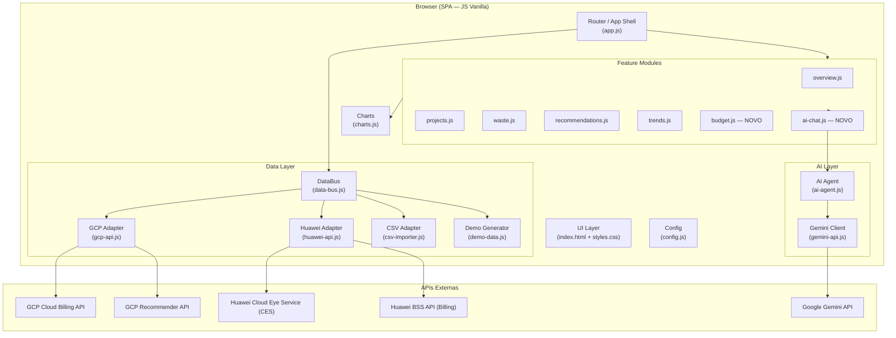
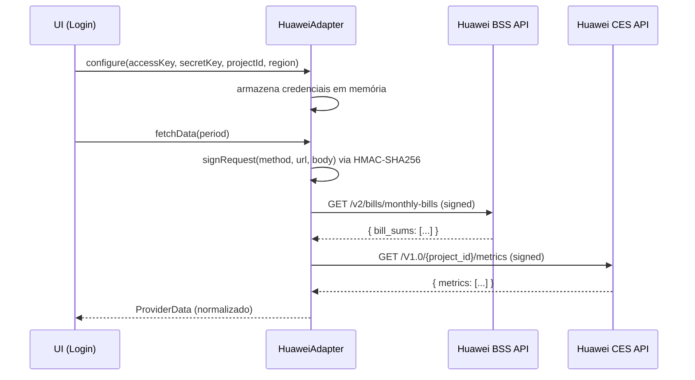
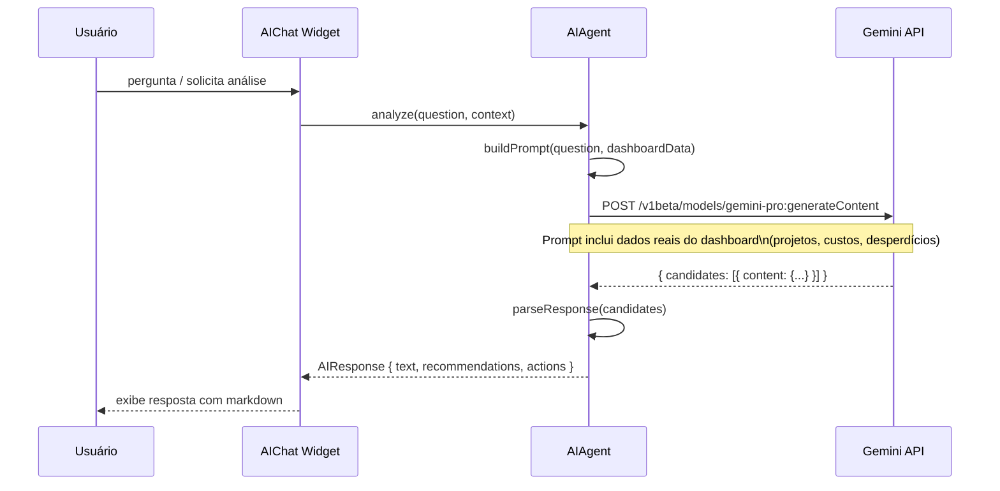
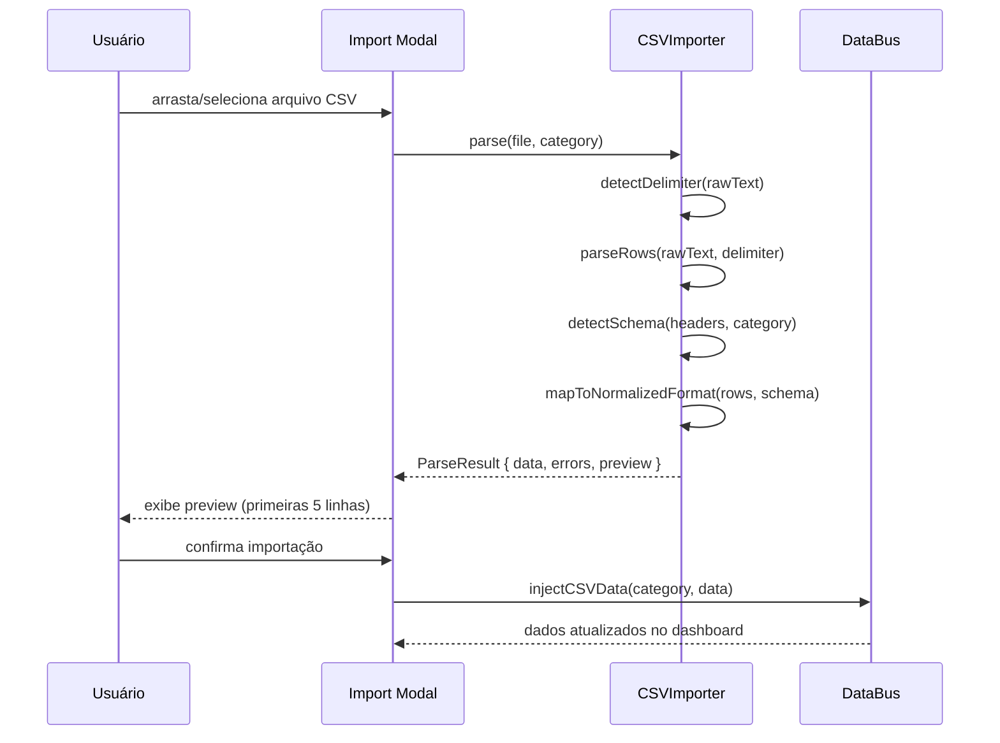

# Design Document: GCP FinOps Dashboard V2

## Visão Geral

A V2 evolui o dashboard de FinOps de single-cloud (GCP) para uma plataforma multi-cloud com inteligência artificial integrada. Mantém a arquitetura web pura (HTML/CSS/JS vanilla, sem backend obrigatório), adicionando quatro pilares: Agente de IA via Gemini API, suporte à Huawei Cloud, painel de orçamento multi-provider e importação de dados via CSV.

A aplicação continua sendo executada inteiramente no browser, com todas as integrações feitas via chamadas diretas às APIs dos provedores. O estado é gerenciado em memória e persistido no `localStorage` para configurações e cache leve.

---

## Arquitetura Geral



---

## Arquitetura de Arquivos (V2)

```
finops-dashboard-v2/
├── index.html          # Shell HTML atualizado (novas páginas + chat widget)
├── styles.css          # Estilos atualizados
├── config.js           # Configurações (GCP + Huawei + Gemini keys)
├── app.js              # App shell, router, orquestração
├── data-bus.js         # NOVO: agregador de dados multi-provider
├── gcp-api.js          # Atualizado: mantém OAuth2 + Billing API
├── huawei-api.js       # NOVO: autenticação AK/SK + BSS/CES APIs
├── gemini-api.js       # NOVO: cliente Gemini API
├── ai-agent.js         # NOVO: lógica do agente FinOps
├── csv-importer.js     # NOVO: parser e mapeamento de CSV
├── charts.js           # Atualizado: novos gráficos multi-provider
├── demo-data.js        # Extraído de gcp-api.js + dados Huawei demo
└── pages/
    ├── overview.js     # Atualizado
    ├── projects.js     # Atualizado
    ├── waste.js        # Atualizado
    ├── recommendations.js  # Atualizado (integra sugestões do AI)
    ├── trends.js       # Atualizado
    └── budget.js       # NOVO: painel multi-provider
```

---

## Componentes e Interfaces

### 1. DataBus — Agregador Multi-Provider

**Propósito**: Ponto central de coleta e normalização de dados de todos os provedores. Expõe uma interface unificada para os módulos de UI.

**Interface**:
```typescript
interface DataBus {
  // Carrega dados de todos os providers configurados
  load(period: number): Promise<UnifiedData>

  // Retorna dados já carregados (cache em memória)
  getData(): UnifiedData | null

  // Registra um provider de dados
  registerProvider(provider: DataProvider): void

  // Evento disparado quando dados são atualizados
  onUpdate(callback: (data: UnifiedData) => void): void
}

interface DataProvider {
  id: 'gcp' | 'huawei' | 'csv' | 'demo'
  isConfigured(): boolean
  fetchData(period: number): Promise<ProviderData>
}

interface UnifiedData {
  providers: ProviderData[]        // dados brutos por provider
  summary: UnifiedSummary          // KPIs agregados
  projects: NormalizedProject[]    // projetos/contas de todos os providers
  services: NormalizedService[]    // serviços agregados
  timeline: TimeSeriesPoint[]      // série temporal unificada
  waste: WasteCategory[]
  recommendations: Recommendation[]
  budgets: BudgetEntry[]
  lastUpdated: Date
}
```

---

### 2. HuaweiAdapter — Integração Huawei Cloud

**Propósito**: Autenticação via AK/SK (HMAC-SHA256) e coleta de dados de custo da Huawei Cloud BSS API.

**Fluxo de Autenticação**:


**Interface**:
```typescript
interface HuaweiAdapter extends DataProvider {
  configure(config: HuaweiConfig): void
  isConfigured(): boolean
  fetchBills(startDate: string, endDate: string): Promise<HuaweiBill[]>
  fetchMetrics(projectId: string): Promise<HuaweiMetric[]>
  signRequest(method: string, url: string, body: string): HuaweiSignedHeaders
}

interface HuaweiConfig {
  accessKey: string      // AK
  secretKey: string      // SK (nunca enviado para APIs externas além da Huawei)
  projectId: string
  region: string         // ex: "la-south-2" (São Paulo)
  domainId?: string
}

interface HuaweiSignedHeaders {
  'X-Sdk-Date': string
  'Authorization': string
  'Content-Type': string
}
```

**Assinatura HMAC-SHA256 (AK/SK)**:
```javascript
// Implementação no browser usando Web Crypto API
async function signRequest(method, url, body, config) {
  const date = new Date().toISOString().replace(/[:-]|\.\d{3}/g, '').slice(0, 15) + 'Z'
  const parsedUrl = new URL(url)
  const canonicalUri = parsedUrl.pathname
  const canonicalQuery = parsedUrl.searchParams.toString()
  const payloadHash = await sha256Hex(body || '')
  const canonicalHeaders = `content-type:application/json\nhost:${parsedUrl.host}\nx-sdk-date:${date}\n`
  const signedHeaders = 'content-type;host;x-sdk-date'
  const canonicalRequest = [method, canonicalUri, canonicalQuery, canonicalHeaders, signedHeaders, payloadHash].join('\n')
  const credentialScope = `${date.slice(0,8)}/la-south-2/bss/sdk_request`
  const stringToSign = `SDK-HMAC-SHA256\n${date}\n${credentialScope}\n${await sha256Hex(canonicalRequest)}`
  const signingKey = await deriveSigningKey(config.secretKey, date.slice(0,8), config.region)
  const signature = await hmacHex(signingKey, stringToSign)
  return {
    'X-Sdk-Date': date,
    'Authorization': `SDK-HMAC-SHA256 Credential=${config.accessKey}/${credentialScope}, SignedHeaders=${signedHeaders}, Signature=${signature}`,
    'Content-Type': 'application/json'
  }
}
```

---

### 3. GeminiClient + AIAgent — Agente de IA

**Propósito**: Integração com Gemini API para análise automática de custos e chat interativo.

**Fluxo do Agente**:


**Interface**:
```typescript
interface GeminiClient {
  generate(prompt: string, options?: GenerateOptions): Promise<string>
  generateStream(prompt: string, onChunk: (text: string) => void): Promise<void>
}

interface AIAgent {
  // Análise automática ao carregar dados
  autoAnalyze(data: UnifiedData): Promise<AIInsight[]>

  // Chat interativo
  chat(message: string, history: ChatMessage[]): Promise<AIResponse>

  // Gera recomendações baseadas nos dados atuais
  generateRecommendations(data: UnifiedData): Promise<Recommendation[]>
}

interface AIInsight {
  type: 'anomaly' | 'trend' | 'saving' | 'risk'
  title: string
  description: string
  severity: 'low' | 'medium' | 'high' | 'critical'
  affectedResources: string[]
  estimatedImpact: number  // em R$
}

interface AIResponse {
  text: string              // resposta em markdown
  insights: AIInsight[]     // insights estruturados extraídos
  suggestedActions: string[] // ações sugeridas
}

interface ChatMessage {
  role: 'user' | 'model'
  content: string
  timestamp: Date
}
```

**Construção do Prompt de Contexto**:
```javascript
function buildSystemPrompt(data) {
  return `Você é um especialista em FinOps e otimização de custos cloud.
Analise os dados abaixo e responda em português brasileiro.

DADOS DO DASHBOARD (período: ${data.period} dias):
- Gasto total: ${fmt(data.summary.currentMonthCost)}
- Desperdício identificado: ${fmt(data.summary.totalWaste)} (${data.summary.wastePercent}%)
- Economia potencial: ${fmt(data.summary.potentialSaving)}
- Providers ativos: ${data.providers.map(p => p.id).join(', ')}
- Top 3 projetos por custo: ${data.projects.slice(0,3).map(p => `${p.name}: ${fmt(p.currentCost)}`).join(', ')}
- Principais desperdícios: ${data.waste.slice(0,3).map(w => `${w.category}: ${fmt(w.totalWaste)}`).join(', ')}

Seja direto, objetivo e sempre quantifique o impacto financeiro das recomendações.`
}
```

---

### 4. CSVImporter — Importação de Dados

**Propósito**: Permite importar arquivos CSV como fonte de dados alternativa ou complementar para qualquer categoria.

**Fluxo de Importação**:


**Interface**:
```typescript
interface CSVImporter {
  parse(file: File, category: CSVCategory): Promise<ParseResult>
  detectSchema(headers: string[], category: CSVCategory): ColumnMapping
  mapToNormalizedFormat(rows: Record<string, string>[], mapping: ColumnMapping): NormalizedData
}

type CSVCategory = 'projects' | 'waste' | 'recommendations' | 'costs'

interface ParseResult {
  data: NormalizedData
  errors: ParseError[]
  preview: Record<string, string>[]  // primeiras 5 linhas
  rowCount: number
  detectedEncoding: string
}

interface ColumnMapping {
  // mapeamento de colunas detectadas → campos internos
  [internalField: string]: string  // ex: { "name": "Project Name", "cost": "Monthly Cost (BRL)" }
}
```

**Schemas de CSV Suportados**:

| Categoria | Campos Obrigatórios | Campos Opcionais |
|-----------|--------------------|--------------------|
| `costs` | `date`, `cost` | `project`, `service`, `region` |
| `projects` | `name`, `cost` | `id`, `budget`, `environment` |
| `waste` | `name`, `cost`, `category` | `reason`, `action`, `project` |
| `recommendations` | `title`, `saving` | `priority`, `category`, `effort`, `description` |

---

### 5. BudgetModule — Painel Multi-Provider

**Propósito**: Exibe gastos de GCP e Huawei Cloud lado a lado com linha de orçamento configurável.

**Interface**:
```typescript
interface BudgetModule {
  render(data: UnifiedData, config: BudgetConfig): void
  updateBudgetLine(provider: string, amount: number): void
  exportReport(): void
}

interface BudgetConfig {
  budgets: {
    [provider: string]: {
      monthly: number
      alert75: boolean
      alert90: boolean
      alert100: boolean
    }
  }
  currency: 'BRL' | 'USD'
  showProjected: boolean
}

interface BudgetEntry {
  provider: 'gcp' | 'huawei' | 'csv' | 'total'
  currentSpend: number
  budgetLimit: number
  projectedSpend: number
  utilizationPct: number
  trend: 'up' | 'down' | 'stable'
  monthlyBreakdown: { month: string; spend: number; budget: number }[]
}
```

---

## Modelos de Dados

### NormalizedProject (multi-provider)
```typescript
interface NormalizedProject {
  id: string
  name: string
  provider: 'gcp' | 'huawei' | 'csv'
  currentCost: number
  previousCost: number
  budget: number
  change: number           // % vs período anterior
  services: ServiceCost[]
  timeSeries: TimeSeriesPoint[]
  environment?: string
  region?: string
  tags?: Record<string, string>
}
```

### UnifiedSummary
```typescript
interface UnifiedSummary {
  // Por provider
  byProvider: {
    [provider: string]: {
      currentCost: number
      previousCost: number
      budget: number
      utilizationPct: number
    }
  }
  // Totais agregados
  totalCurrentCost: number
  totalPreviousCost: number
  totalBudget: number
  totalWaste: number
  potentialSaving: number
  wastePercent: number
  savingPercent: number
  activeProjects: number
  activeProviders: string[]
}
```

---

## Tratamento de Erros

### CORS e Limitações do Browser

A Huawei BSS API e algumas APIs GCP podem não suportar CORS para chamadas diretas do browser. Estratégia de fallback:

| Situação | Comportamento |
|----------|--------------|
| API indisponível / CORS bloqueado | Exibe aviso + oferece importação CSV como alternativa |
| Token GCP expirado | Re-autentica via redirect OAuth2 |
| Gemini API sem chave | Desabilita módulo AI, exibe instrução de configuração |
| CSV com schema inválido | Exibe erros por linha + permite mapeamento manual de colunas |
| Huawei AK/SK inválido | Exibe mensagem de erro específica + link para documentação |

### Cenários de Erro por Módulo

**HuaweiAdapter**:
- `HUAWEI_AUTH_ERROR`: AK/SK inválido → exibe modal de reconfiguração
- `HUAWEI_CORS_ERROR`: API bloqueada por CORS → sugere proxy ou CSV
- `HUAWEI_RATE_LIMIT`: 429 → retry com backoff exponencial (3 tentativas)

**GeminiClient**:
- `GEMINI_NO_KEY`: chave não configurada → desabilita chat, exibe CTA de configuração
- `GEMINI_QUOTA_EXCEEDED`: 429 → exibe mensagem + desabilita por 60s
- `GEMINI_SAFETY_BLOCK`: resposta bloqueada → exibe mensagem genérica

**CSVImporter**:
- `CSV_ENCODING_ERROR`: arquivo não é UTF-8 → tenta latin-1 automaticamente
- `CSV_MISSING_REQUIRED`: coluna obrigatória ausente → exibe mapeamento manual
- `CSV_EMPTY_FILE`: arquivo vazio → erro imediato

---

## Estratégia de Testes

### Testes Unitários (Jest ou Vitest)

Módulos prioritários para teste:
- `HuaweiAdapter.signRequest()` — verificar assinatura HMAC-SHA256 correta
- `CSVImporter.detectSchema()` — verificar detecção automática de colunas
- `CSVImporter.mapToNormalizedFormat()` — verificar mapeamento correto
- `DataBus.load()` — verificar agregação de múltiplos providers
- `AIAgent.buildSystemPrompt()` — verificar inclusão correta dos dados

### Testes de Propriedade (fast-check)

**Biblioteca**: fast-check

Propriedades a verificar:
- Para qualquer conjunto de dados de providers, `DataBus.aggregate()` deve retornar `totalCost === sum(providers[*].cost)`
- Para qualquer CSV válido, `CSVImporter.parse()` deve retornar `rowCount === linhas_do_arquivo - 1` (header)
- Para qualquer `BudgetEntry`, `utilizationPct === (currentSpend / budgetLimit) * 100`
- A assinatura HMAC-SHA256 deve ser determinística: mesmos inputs → mesma assinatura

### Testes de Integração

- Fluxo completo GCP OAuth2 → load → render (com mock da API)
- Fluxo CSV upload → parse → inject → render
- Fluxo Gemini chat → prompt → response → render

---

## Considerações de Segurança

| Risco | Mitigação |
|-------|-----------|
| AK/SK Huawei expostos no browser | Armazenados apenas em memória (nunca em localStorage/cookies); limpos no logout |
| Gemini API Key exposta no JS | Configurada em `config.js` (não commitado); documentar no `.gitignore` |
| XSS via dados da API | Sanitizar todo conteúdo dinâmico com `textContent` em vez de `innerHTML` onde possível; usar DOMPurify para markdown do AI |
| CSRF | N/A — aplicação stateless sem backend |
| Dados sensíveis de custo | Nunca enviados para terceiros além das APIs configuradas; Gemini recebe apenas agregados, não dados brutos de billing |

---

## Considerações de Performance

- **Lazy loading de módulos**: cada página carrega seu JS apenas quando navegada pela primeira vez
- **Cache de dados**: `DataBus` mantém cache em memória por 5 minutos; evita re-fetch desnecessário
- **Streaming do Gemini**: usar `generateStream()` para exibir resposta progressivamente (melhor UX)
- **CSV parsing**: processar em chunks de 1000 linhas para não bloquear a thread principal (usar `setTimeout` ou `requestIdleCallback`)
- **Charts**: destruir instâncias Chart.js antes de recriar (já feito na V1 com `destroyChart()`)

---

## Dependências

| Biblioteca | Versão | Uso |
|-----------|--------|-----|
| Chart.js | 4.4.x | Gráficos (já existente) |
| chartjs-plugin-datalabels | 2.2.x | Labels nos gráficos (já existente) |
| chartjs-adapter-date-fns | 3.0.x | Eixo de datas (já existente) |
| DOMPurify | 3.x | Sanitização do markdown do AI (NOVO) |
| marked | 9.x | Renderização de markdown nas respostas do AI (NOVO) |

Todas as dependências via CDN — sem bundler, sem npm, mantendo a filosofia da V1.

---

## Algoritmos Principais (Low-Level)

### Algoritmo de Agregação Multi-Provider

```javascript
// data-bus.js
async function loadAllProviders(period) {
  const results = await Promise.allSettled(
    registeredProviders
      .filter(p => p.isConfigured())
      .map(p => p.fetchData(period))
  )

  const successfulData = results
    .filter(r => r.status === 'fulfilled')
    .map(r => r.value)

  if (successfulData.length === 0) {
    return demoProvider.fetchData(period)  // fallback para demo
  }

  return aggregate(successfulData)
}

function aggregate(providerDataList) {
  // Precondição: providerDataList.length >= 1
  const allProjects = providerDataList.flatMap(pd => pd.projects)
  const allTimelines = mergeTimelines(providerDataList.map(pd => pd.timeline))
  const totalCost = providerDataList.reduce((sum, pd) => sum + pd.summary.currentCost, 0)
  // Pós-condição: result.summary.totalCurrentCost === sum(providerDataList[*].summary.currentCost)
  return {
    providers: providerDataList,
    projects: allProjects,
    timeline: allTimelines,
    summary: buildUnifiedSummary(providerDataList),
    waste: mergeWaste(providerDataList),
    recommendations: mergeRecommendations(providerDataList),
    budgets: buildBudgetEntries(providerDataList),
    lastUpdated: new Date()
  }
}
```

### Algoritmo de Detecção de Schema CSV

```javascript
// csv-importer.js
function detectSchema(headers, category) {
  const normalizedHeaders = headers.map(h => h.toLowerCase().trim())
  const schemaMap = {
    costs: {
      date:    ['date', 'data', 'period', 'periodo', 'month', 'mes'],
      cost:    ['cost', 'custo', 'amount', 'valor', 'total', 'spend'],
      project: ['project', 'projeto', 'project_id', 'account'],
      service: ['service', 'servico', 'product', 'produto']
    },
    projects: {
      name:   ['name', 'nome', 'project', 'projeto', 'project_name'],
      cost:   ['cost', 'custo', 'amount', 'valor', 'monthly_cost'],
      budget: ['budget', 'orcamento', 'limit', 'limite']
    }
    // ... outros schemas
  }

  const mapping = {}
  const targetSchema = schemaMap[category] || {}

  for (const [field, aliases] of Object.entries(targetSchema)) {
    const match = normalizedHeaders.find(h => aliases.some(alias => h.includes(alias)))
    if (match) {
      mapping[field] = headers[normalizedHeaders.indexOf(match)]
    }
  }

  return mapping
  // Pós-condição: todos os campos obrigatórios da categoria estão em mapping
  // ou o caller deve solicitar mapeamento manual
}
```

### Algoritmo de Merge de Timelines

```javascript
// data-bus.js
function mergeTimelines(timelines) {
  // Agrupa por data e soma custos de todos os providers
  const dateMap = new Map()

  for (const timeline of timelines) {
    for (const point of timeline) {
      const existing = dateMap.get(point.date) || 0
      dateMap.set(point.date, existing + point.cost)
    }
  }

  return Array.from(dateMap.entries())
    .map(([date, cost]) => ({ date, cost }))
    .sort((a, b) => a.date.localeCompare(b.date))
  // Invariante de loop: dateMap contém a soma acumulada de todos os providers para cada data processada
}
```

### Algoritmo de Construção de Prompt Contextual

```javascript
// ai-agent.js
function buildContextualPrompt(userMessage, data, history) {
  const systemContext = buildSystemPrompt(data)
  const historyText = history
    .slice(-6)  // últimas 6 mensagens para não exceder context window
    .map(m => `${m.role === 'user' ? 'Usuário' : 'Assistente'}: ${m.content}`)
    .join('\n')

  return {
    contents: [
      { role: 'user', parts: [{ text: systemContext }] },
      ...history.slice(-6).map(m => ({
        role: m.role,
        parts: [{ text: m.content }]
      })),
      { role: 'user', parts: [{ text: userMessage }] }
    ],
    generationConfig: {
      temperature: 0.4,      // baixo para respostas mais factuais
      maxOutputTokens: 1024,
      topP: 0.8
    },
    safetySettings: [
      { category: 'HARM_CATEGORY_DANGEROUS_CONTENT', threshold: 'BLOCK_ONLY_HIGH' }
    ]
  }
}
```

---

## Correctness Properties

*A property is a characteristic or behavior that should hold true across all valid executions of a system — essentially, a formal statement about what the system should do. Properties serve as the bridge between human-readable specifications and machine-verifiable correctness guarantees.*

### Property 1: Agregação consistente de custos

*Para qualquer* conjunto de providers P com dados carregados com sucesso, o custo total agregado pelo DataBus deve ser exatamente igual à soma dos custos individuais de cada provider: `aggregate(P).summary.totalCurrentCost === Σ p.summary.currentCost ∀ p ∈ P`

**Validates: Requirements 3.1**

---

### Property 2: Merge de timelines por data

*Para qualquer* conjunto de timelines de múltiplos providers, o custo de cada data na timeline unificada deve ser igual à soma dos custos de todos os providers para aquela data.

**Validates: Requirements 3.2**

---

### Property 3: Assinatura HMAC-SHA256 determinística

*Para quaisquer* inputs fixos (method, url, body, credenciais AK/SK, timestamp), a função `signRequest()` do Huawei_Adapter deve sempre produzir exatamente a mesma assinatura — mesmos inputs implicam mesma saída.

**Validates: Requirements 2.2**

---

### Property 4: Fallback garantido do DataBus

*Para qualquer* cenário onde todos os providers configurados falham ao carregar dados, o DataBus deve retornar dados válidos do Demo_Provider sem lançar exceção para a camada de UI — o retorno nunca é null.

**Validates: Requirements 3.5, 10.2**

---

### Property 5: Budget utilization invariant

*Para qualquer* BudgetEntry b onde `b.budgetLimit > 0`, o campo `b.utilizationPct` deve ser igual a `(b.currentSpend / b.budgetLimit) * 100`, e `b.utilizationPct` deve ser sempre maior ou igual a zero.

**Validates: Requirements 7.2**

---

### Property 6: Sanitização de conteúdo AI

*Para qualquer* texto retornado pelo Gemini_Client, o HTML gerado após renderização markdown deve ser sanitizado via DOMPurify antes de ser inserido no DOM — nenhum script ou HTML arbitrário é executado.

**Validates: Requirements 6.3, 8.4**

---

### Property 7: Isolamento de credenciais no prompt AI

*Para qualquer* UnifiedData passado ao AI_Agent, o payload construído para envio ao Gemini_Client não deve conter credenciais de autenticação (AK/SK, tokens OAuth2, API keys) — apenas dados agregados de custo são incluídos.

**Validates: Requirements 5.3, 8.3**

---

### Property 8: rowCount do CSV igual ao número de linhas de dados

*Para qualquer* arquivo CSV válido com N linhas de dados (excluindo o cabeçalho), o ParseResult retornado pelo CSV_Importer deve ter `rowCount === N`.

**Validates: Requirements 4.2**

---

### Property 9: Detecção de schema por aliases

*Para qualquer* conjunto de cabeçalhos CSV que contenha pelo menos um alias reconhecido para um campo interno de uma categoria, o CSV_Importer deve mapear corretamente esse cabeçalho ao campo interno correspondente.

**Validates: Requirements 4.3**

---

### Property 10: Idempotência do CSV

*Para qualquer* arquivo CSV válido F, re-parsear os dados já normalizados deve produzir o mesmo resultado: `parse(parse(F).data) === parse(F).data` — a normalização é idempotente.

**Validates: Requirements 4.4**

---

### Property 11: Prompt contextual inclui métricas financeiras

*Para qualquer* UnifiedData com dados válidos, o prompt construído pelo AI_Agent deve conter o gasto total, o percentual de desperdício, a economia potencial, os providers ativos e os top 3 projetos por custo.

**Validates: Requirements 5.2**
